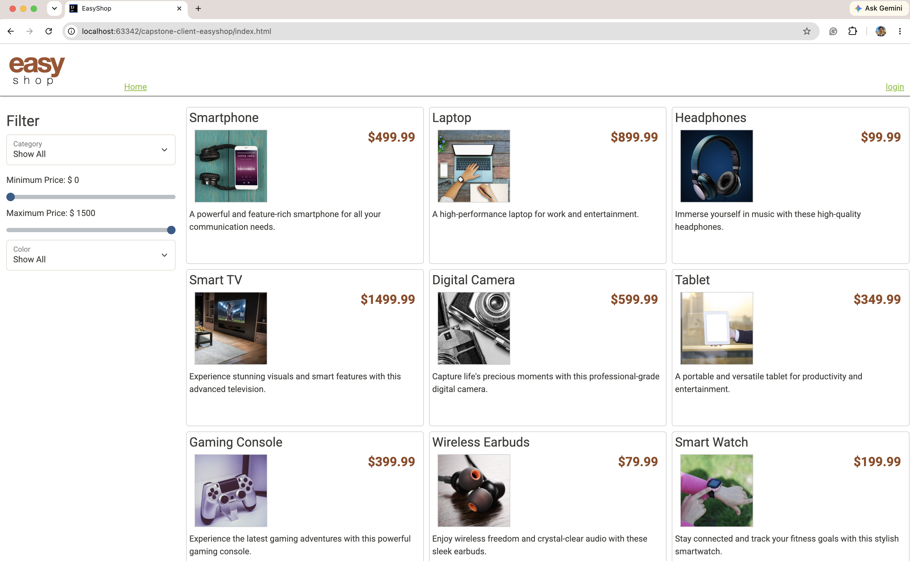
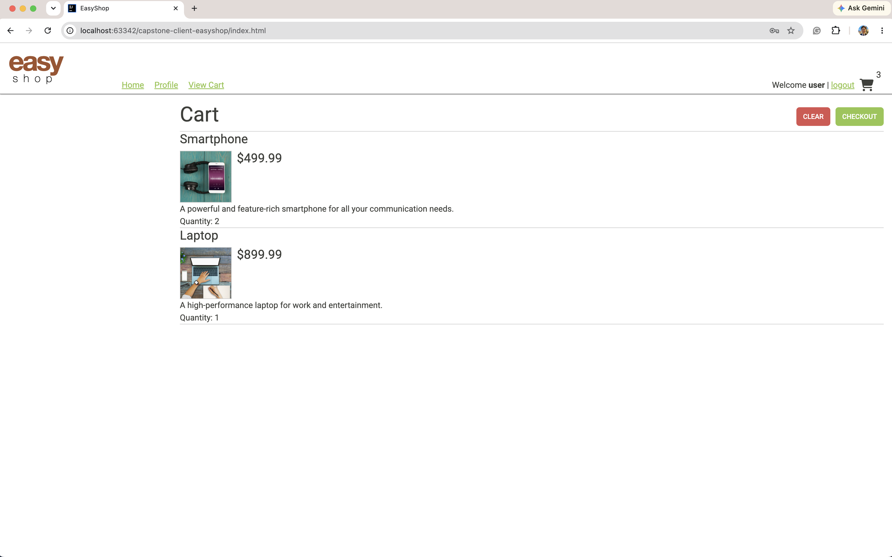

# 🛍️ EasyShop — Storefront (Frontend)

The customer-facing website for **EasyShop**, an online store. Shoppers can browse the catalog,
filter products, log in, manage a shopping cart, update their profile, and check out. It's a
lightweight site built with **vanilla JavaScript**, **axios**, and **Bootstrap**, and it talks to
the EasyShop REST API for all of its data.

> 🔗 **Backend API:** [easyshop-api](https://github.com/thejunyongjung/easyshop-api) — the Spring Boot
> service this site calls. The frontend is just the "face"; the API does the real work (data, security, orders).




---

## 🧩 How it fits together

```
Browser (this site)  ──HTTP / axios──▶  EasyShop API (localhost:8080)  ──▶  MySQL
```

The site sends requests (log in, get products, add to cart, check out) to the API and renders
whatever comes back. When you log in, it stores your token in the browser and attaches it to the
requests that require authentication.

## 🚀 Running it locally

> [!IMPORTANT]
> **Start the API first.** This site is only the front end — it needs the
> [easyshop-api](https://github.com/thejunyongjung/easyshop-api) running at `http://localhost:8080`
> (start MySQL, then run the Spring Boot app).

Then open this site one of these ways:
- **Open `index.html` in your browser** (in IntelliJ: right-click it → *Open in Browser*), or
- Serve the folder with any static server, e.g.:
  ```bash
  python3 -m http.server 5500
  ```
  then visit `http://localhost:5500`.

The API URL the site calls lives in [`js/config.js`](js/config.js):
```js
const config = {
    baseUrl: 'http://localhost:8080'
}
```

**Sample logins** (password is `password` for all): `user` (shopper), `admin` (admin).

## ✨ What I changed / fixed

This started from the provided Version 1 storefront. My changes — each tracked as its own
issue → branch → pull request on the project board:

- **Checkout** — added a **Checkout** button on the cart that places an order
  (`POST /orders`), empties the cart, and refreshes the page.
- **Cart count fix** — the cart badge counted *distinct products*; it now sums the
  **total quantity**, so adding the same item twice correctly shows **2**.
- **Cart header layout** — grouped the **Clear** and **Checkout** buttons neatly on the right.
- **Price filter label** — the second slider was mislabeled "Minimum Price"; fixed it to
  **"Maximum Price."**
- **Page title** — the browser tab read "Title"; set it to **"EasyShop."**
- **Logout redirect** — logging out now returns you to the home page.

The cart below shows three of those fixes at once — the green **Checkout** button, the badge
counting **total quantity** (3), and the **Clear / Checkout** buttons grouped on the right:



## 📂 Project structure

```
.
├── index.html               # the single-page shell
├── css/                     # main.css + Bootstrap
├── images/                  # product images used by the store
├── docs/                    # screenshots for this README
├── templates/               # HTML fragments rendered by the template builder
└── js/
    ├── config.js            # API base URL
    ├── application.js       # wires up the page
    ├── template-builder.js  # renders templates into the page
    ├── filter.js            # product filtering
    ├── lib/                 # third-party libraries (axios, etc.)
    └── services/            # one module per API area
        ├── products-service.js
        ├── categories-service.js
        ├── shoppingcart-service.js   # cart logic + checkout
        ├── profile-service.js
        └── user-service.js           # login / logout
```
